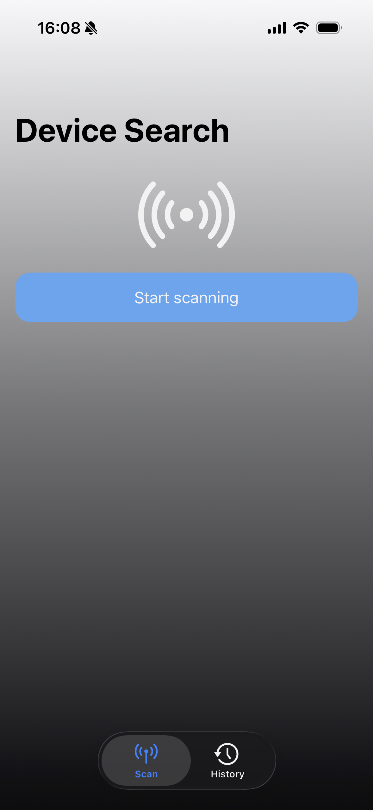
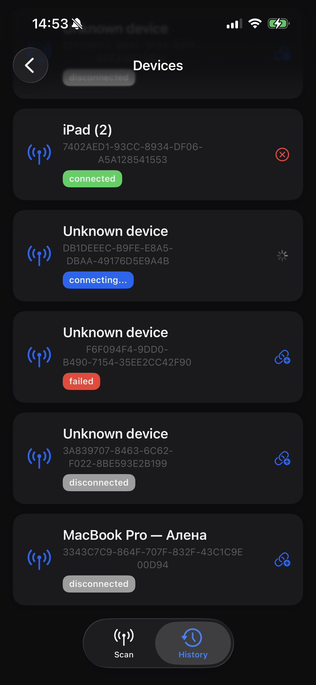

# 📱 Device Scanner App

Приложение для поиска устройств в локальной сети и по Bluetooth.
Поддерживает объединённое сканирование, историю сессий, просмотр найденных устройств и подключение к BLE-устройствам.

---

## Возможности

### Сканирование устройств
- Поиск **Bluetooth Low Energy (BLE)** устройств
- Поиск устройств по **LAN / Bonjour (mDNS)**
- Одновременное комбинированное сканирование
- Плавный прогресс-бар сканирования
- Исключение дублирующихся устройств
- Обработка ошибок (отключён Bluetooth, недоступные сервисы и т.д.)

### История
- Сохранение каждой сессии сканирования
- Просмотр списка всех прошлых сессий
- Просмотр устройств, найденных в конкретной сессии
- Поиск устройств по имени

### Работа с Bluetooth-устройствами
- Подключение к выбранному BLE-устройству
- Отключение устройства
- Отображение статуса: `discovered`, `connecting`, `connected`

> LAN-устройства (Bonjour) доступны только для обнаружения.

---

## Архитектура

Проект построен на основе **MVVM**.

### **Сервисы**
- `BluetoothService` — работа с CoreBluetooth
- `LANService` — поиск Bonjour/mDNS сервисов через `NetServiceBrowser`
- `ScanService` — обёртка, объединяющая BLE и LAN сканирование

### **Data Layer**
- Core Data
  - `ScanSessionEntity`
  - `DeviceEntity`
- Репозитории:
  - `DeviceRepository`
  - `ScanSessionRepository`

### **UI слой**
- SwiftUI Views
- ViewModel'и с использованием Combine

### **DI**
Используется **Swinject**:
Все сервисы, репозитории создаются через DI-контейнер, VM создаются через `ViewModelFactory`.

---

##  Используемые технологии

- SwiftUI
- Combine
- CoreBluetooth
- NetServiceBrowser (Bonjour/mDNS)
- Core Data
- Swinject
- MVVM
- Lottie анимация

---

## Скриншоты
<table>
<tr>
<td align="center" width="50%">
   
  <b>Главный экран</b> 
  <small>Основной интерфейс приложения</small>
</td>
<td align="center" width="50%">
   
  <b>Список устройств</b> 
  <small>Найденные устройства</small>
</td>
</tr>
</table>